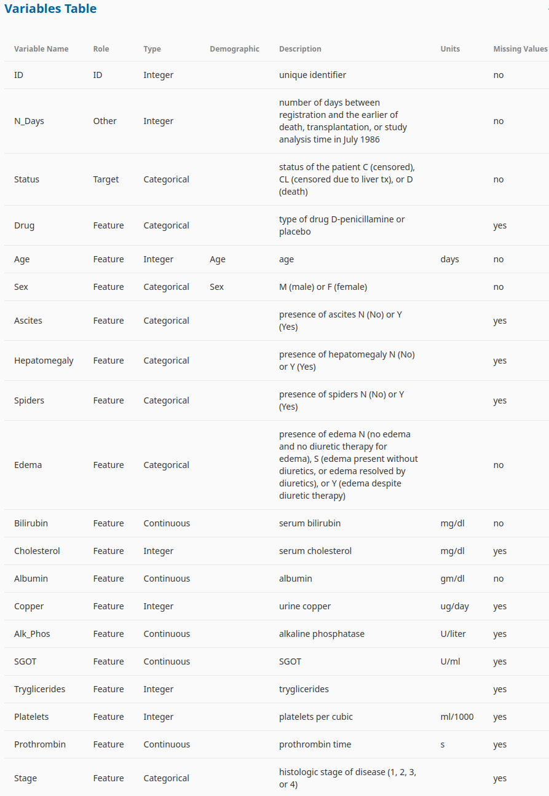

# Multi-Class Prediction of Cirrhosis Outcomes

    Playground Series - Season 3, Episode 26

Competition link: <https://www.kaggle.com/competitions/playground-series-s3e26>

* Task is to use a multi-class approach to predict the the outcomes of patients with cirrhosis.

### Dataset  Information

The dataset for this competition (both train and test) was generated from a deep learning model trained on the Cirrhosis Patient Survival Prediction dataset. Feature distributions are close to, but not exactly the same, as the original. Feel free to use the original dataset as part of this competition, both to explore differences as well as to see whether incorporating the original in training improves model performance.



### **Files**

1. **train.csv** - the training dataset

    * `Status` is the categorical target
    * `C` (censored) indicates the patient was alive at `N_Days`
    * `CL` indicates the patient was alive at `N_Days` due to liver a transplant
    * `D` indicates the patient was deceased at `N_Days`

2. **test.csv** - the test dataset; your objective is to predict the probability of each of the three Status values, e.g., `Status_C`, `Status_CL`, `Status_D`.

3. **sample_submission.csv** - a sample submission file in the correct format.

    For each id row in the test set, you must predict probabilities of the three outcomes `Status_C`, `Status_CL`, and `Status_D` . The file should contain a header and have the following format:

    ```
    id,Status_C,Status_CL,Status_D
    7905,0.628084,0.034788,0.337128
    7906,0.628084,0.034788,0.337128
    7907,0.628084,0.034788,0.337128
    etc.
    ```
